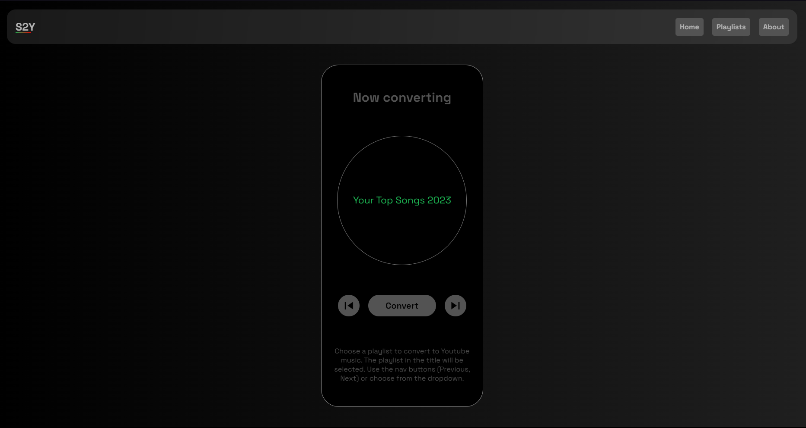
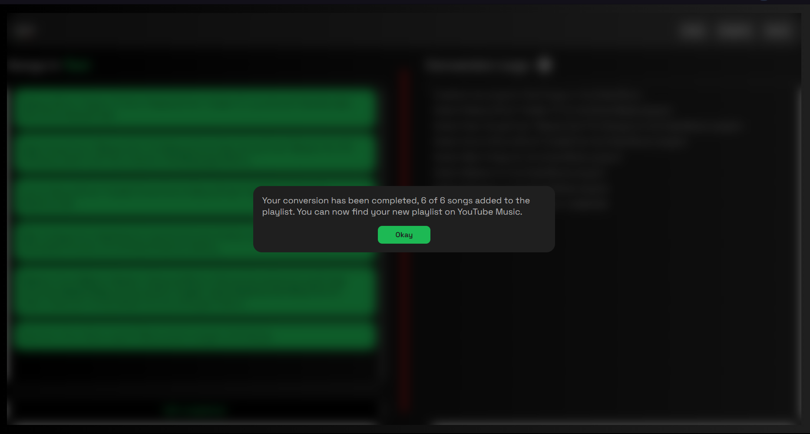

# Switchify
 
 Switchify is an effecient playlist transfer website that does copy playlists from Spotify to Youtube Music. I started this project as an alternative of Tune My Music, which won't allow users to transfer more than 200 songs in a go. Being a huge fan of music, i often switch between audio platforms and i'm pretty sure most of us does the same. That is when i decided to create my own playlist transfer application. Being a web developer, I started building a website for the same. And here it is.

***Switchify does not store any data. Every password you enter is either in Google's in Spotify's authentication page.***
  

# Website

Once you click **Switch to Youtube Music**, you will be redirected to spotify's own authentication page where you enter your credentials. Once the auth flow has been completed, you will see this page.

This is the page where you can select the playlist that you want to convert from Spotify to Youtube music. You can either click on the navigations buttons provided or simply click on the circle and you will see a dropdown from which you can directly select the required playlist. 

Once you click **Convert** you will be redirected to the following page.

Here you can view all the songs in your playlist. You can not interact with the song-titles. Whatever is in the playlist selected, will get copied. As of now, there is no custom-select option. Once you hit the **Start Conversion** button, you will be redirected to the authentication page of Google. After successful login, your playlist transfer will start. 

The logs of the transfer will be shown in the terminal on the left half of the page. The progress
of the transfer will be displayed by the vertical line beside the terminal. Red color inidicates progress.

When the progress bar is completely filled, you can find your playlist completely transfered, reflecting which you will have the following popup window saying 'Conversion completed successfully'. Clicking on **Okay** will close the popup window.

This marks the end of the functionality of the website.
  

# About Page

The website also features a simple about page that displays the basic information of the application and contact details of the developer (that's me).

# Design Idea

You may have noticed that the website's color palette is Green and Black. Have you seen this somewhere else ?

Yessir. It is a homeage to our beloved Spotify before we switch from it.

The red color at places indicates the switch to youtube music.

The logo has a partial underline with a gradient of green to red, which indicates the same. This color selection indicates the transition from Spotify to Youtube music. Also, in the home page, you can find the color of **S** in **Switchify** to be green, and **y** to be red. 
  

# Queries and Feedback

For any Queries and feedback please mail me at notvenupulagam@gmail.com

**Welcome to the Community.**

*Thank you.*